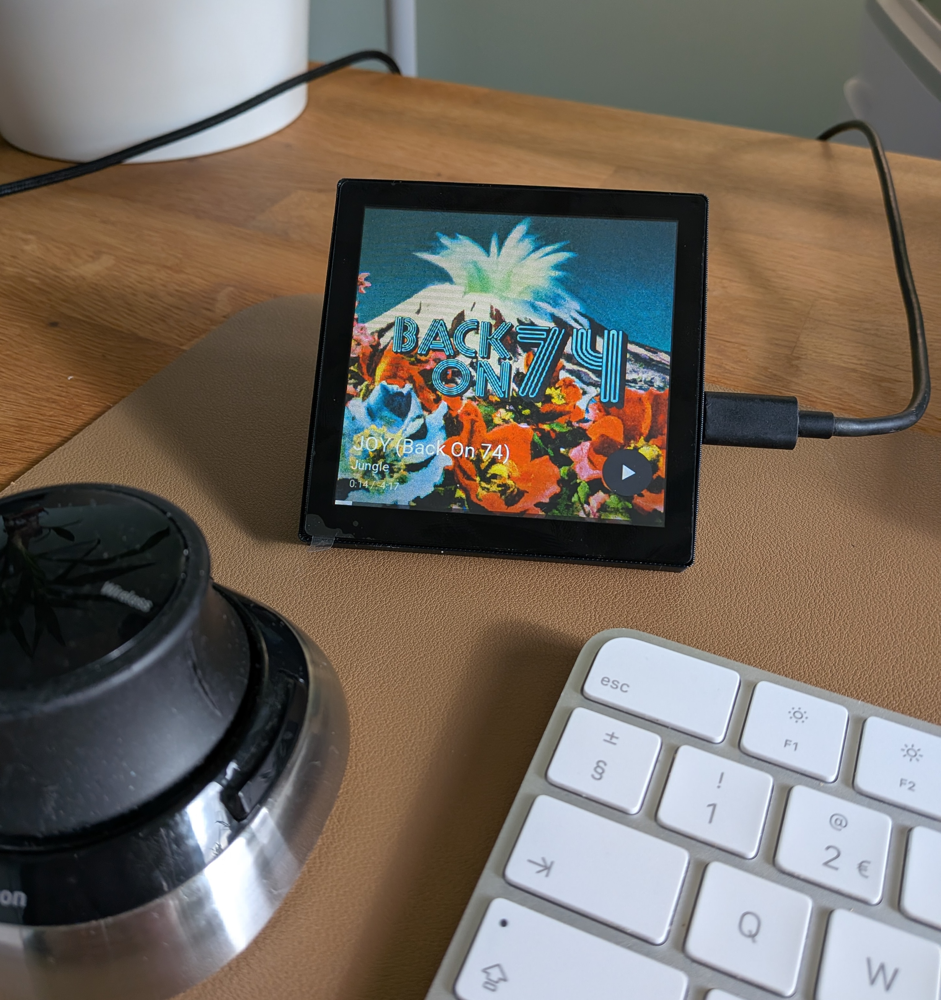

# ESPHome Media Controller for Home Assistant

A touchscreen media controller that shows album art and track info and lets you control play, pause, skip, and volume from any Home Assistant media player. Supports **4"** and **10.1"** panels. Built with [ESPHome](https://esphome.io/) and [LVGL](https://lvgl.io/); tested with Google and Sonos speakers.

---

## Features

- **Album art** — Full-screen cover art from Home Assistant, with smooth transitions between tracks
- **Accent color** — Dominant color extracted from album art, applied to the UI and exposed as an HA light entity
- **Now playing** — Title, artist, elapsed/remaining time, and progress bar
- **Touch controls** — Play/pause, swipe for next/previous, volume arc dial (swipe down)
- **Screensaver** — Day/night aware dimming and screen-off when paused
- **Configurable from Home Assistant** — Media player, brightness, timeouts, track info duration; no reflashing

*Full details: [Features](https://jtenniswood.github.io/esphome-media-player/features)*

---

## Get started

Install guide, web installer, and device setup are on the documentation site:

---

## Documentation

The [documentation site](https://jtenniswood.github.io/esphome-media-player/) has the install guide, configurable settings, manual setup (ESPHome dashboard), and troubleshooting.

**Supported panels:**

| Device | Size | Buy |
|--------|------|-----|
| [Guition ESP32-S3 4848S040](https://jtenniswood.github.io/esphome-media-player/devices/esp32-s3-4848s040) | 4" (480×480) | [AliExpress](https://s.click.aliexpress.com/e/_c3sIhvBv) |
| [Guition ESP32-P4 JC8012P4A1](https://jtenniswood.github.io/esphome-media-player/devices/esp32-p4-jc8012p4a1) | 10.1" (1280×800) | [AliExpress](https://s.click.aliexpress.com/e/_c3wsnU43) |

---

## Feedback

If you have any feedback or suggestions, please open an [issue](https://github.com/jtenniswood/esphome-media-player/issues).

---

## Gallery

### Guition ESP32-P4 (10.1")

### Guition ESP32-S3 4848S040 (4")

More screenshots in the [documentation](https://jtenniswood.github.io/esphome-media-player/).
