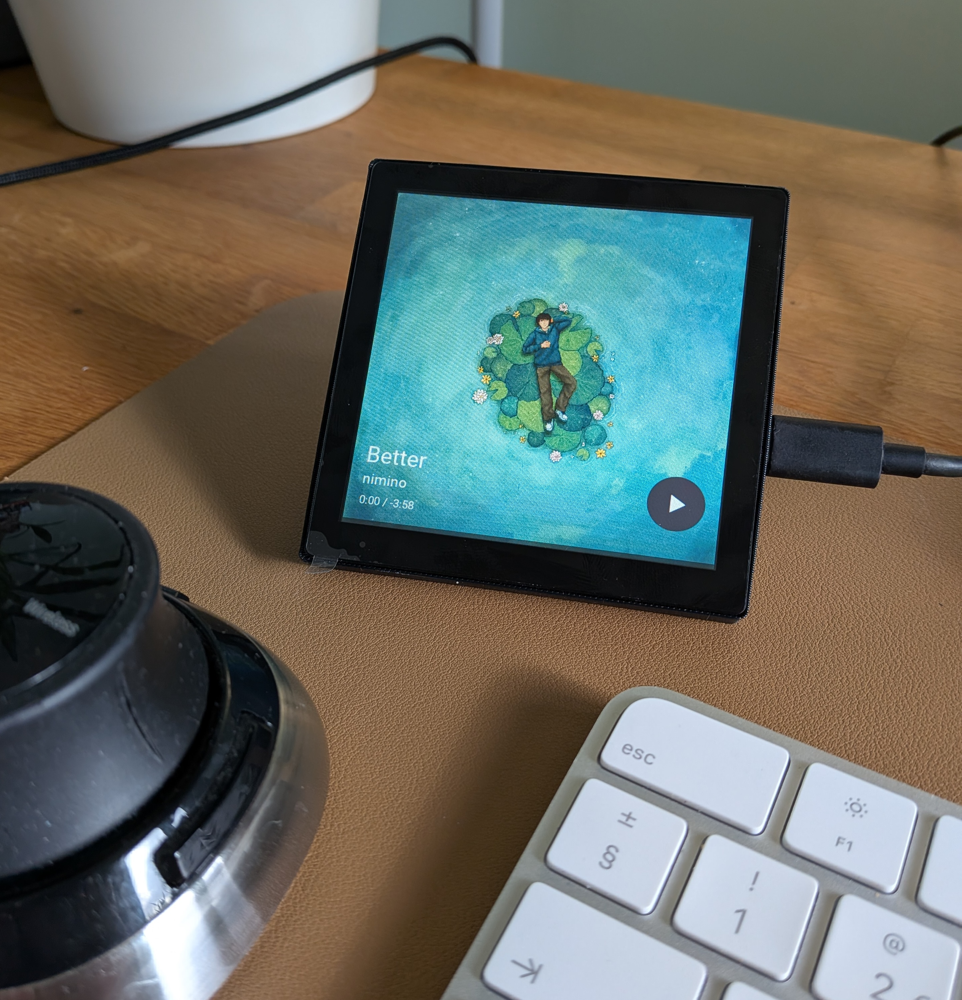
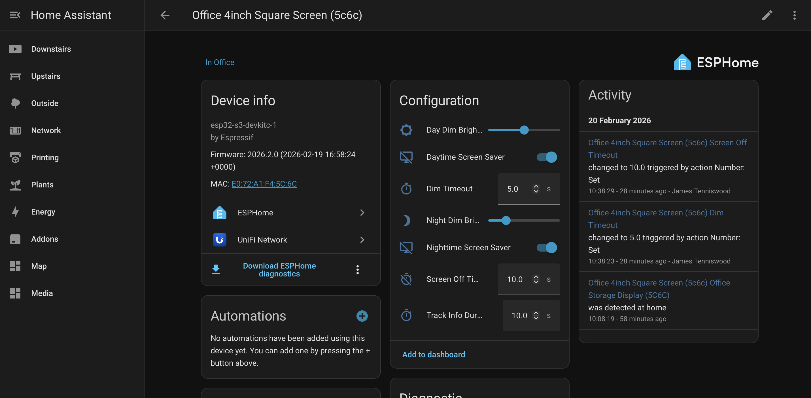
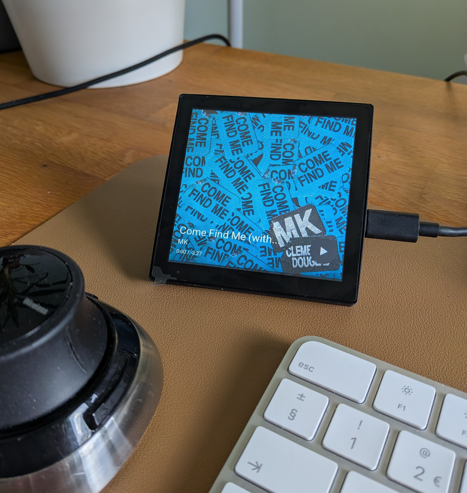
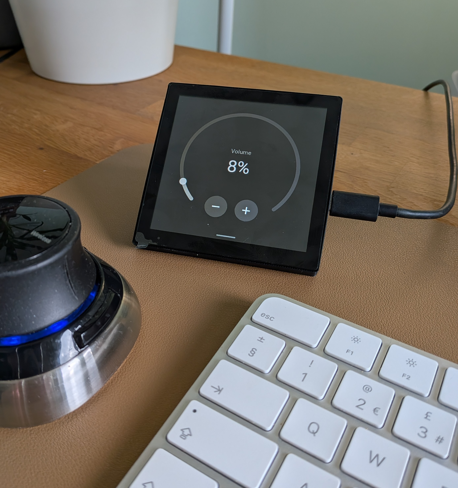

# Guition ESP32-S3 4848S040 (4.0") Music Dashboard



I want to use the cheap [Guition ESP32-S3-4848S040](https://s.click.aliexpress.com/e/_c3sIhvBv) to build a controller to show track artwork and have the ability to skip, pause and control the volume of any media player in Home Assistant

It is built with [ESPHome](https://esphome.io/) and [LVGL](https://lvgl.io/). It connects to [Home Assistant](https://www.home-assistant.io/) to control and collect the track data, and has been tested with Google and Sonos speakers.

---

## Features

### Album Art Display

Full-screen 480x480 album art fetched directly from your Home Assistant instance. When a new track starts, the current artwork dims to 40% opacity while the new image downloads, giving instant visual feedback that a change is happening. Once loaded, the new art fades back to full brightness. 

### Now Playing Info

Displays the song title, artist name, elapsed and remaining time, and a progress bar at the bottom of the screen. The progress bar updates every second with smooth interpolation between Home Assistant position updates. 

### Auto-Hide Track Info

When a new track starts, the overlay (title, artist, time, play/pause button) automatically appears. There are controls in the device page inside Home Assistant. Setting the timer to 0 will keep the overlay permanently visible. See [Configurable Settings](#configurable-settings) for details.

### Touch Controls

- **Play / Pause** -- corner button in the bottom-right corner toggles playback.
- **Next / Previous track** -- swipe the screen to change tracks. 
- **Volume** -- swipe down to open the settings panel, which shows an interactive arc dial. Drag the arc knob to set volume, or use the **+** and **-** buttons for fine 1% adjustments. The current volume percentage is displayed in the centre of the dial. Swipe up to close.
- Hide / ShowUI -- Tap anywhere when the track is playing to hide the UI information.

### Screensaver

When playback is paused, the device has a two-stage screensaver.

1. After a configurable period of inactivity, the screen dims to a day or night brightness level.
2. After a further timeout, the screen turns off completely.

Settings are fully configurable from Home Assistant (see [Configurable Settings](#configurable-settings) below).

---

## Where to Buy

- **Panel:** [AliExpress](https://s.click.aliexpress.com/e/_c3sIhvBv) (~£16)

## Stand

- **Desktop stand** (3D printable): [MakerWorld](https://makerworld.com/en/models/2327976-touch-screen-desktop-stand-for-guition-4848s040#profileId-2543111)

---


## Configurable Settings

### Template Settings (set once during setup)

These values are defined in the `substitutions` block of your ESPHome configuration. You set them when you first create the device and they rarely need changing.


| Setting         | Description                              | Example                    |
| --------------- | ---------------------------------------- | -------------------------- |
| `name`          | Device hostname on your network          | `living-room-music`        |
| `friendly_name` | Display name shown in Home Assistant     | `Living Room Music`        |
| `media_player`  | Entity ID of the media player to control | `media_player.living_room` |


### Backlight and Screensaver Settings (adjustable at runtime)



These settings are exposed as entities under the device's **Configuration** section in Home Assistant. All values persist across reboots.

**Switches:**


| Setting                | Default | Description                                                                                                    |
| ---------------------- | ------- | -------------------------------------------------------------------------------------------------------------- |
| Daytime Screen Saver   | ON      | Allow the screen to turn off completely during the day. When off, the screen stays dimmed but never turns off. |
| Nighttime Screen Saver | ON      | Allow the screen to turn off completely at night. When off, the screen stays dimmed but never turns off.       |


**Brightness:**


| Setting              | Range     | Step | Default | Description                                  |
| -------------------- | --------- | ---- | ------- | -------------------------------------------- |
| Day Dim Brightness   | 0 -- 100% | 5%   | 35%     | Screen brightness when dimmed during the day |
| Night Dim Brightness | 0 -- 100% | 5%   | 25%     | Screen brightness when dimmed at night       |


**Timeouts:**


| Setting            | Range      | Step | Default | Description                                       |
| ------------------ | ---------- | ---- | ------- | ------------------------------------------------- |
| Dim Timeout        | 1 -- 300 s | 1 s  | 60 s    | Seconds of inactivity before the screen dims      |
| Screen Off Timeout | 1 -- 600 s | 1 s  | 300 s   | Seconds after dimming before the screen turns off |


**Track Info:**


| Setting             | Range     | Step | Default | Description                                                                            |
| ------------------- | --------- | ---- | ------- | -------------------------------------------------------------------------------------- |
| Track Info Duration | 0 -- 60 s | 1 s  | 0 s     | Seconds the track info overlay stays visible after a track change. 0 = always visible. |


---

## Beginner's Setup Guide

### Prerequisites

Before you start, make sure you have:

- A **Guition ESP32-S3-4848S040** panel (see [Where to Buy](#where-to-buy))
- **Home Assistant** installed and running
- The **ESPHome add-on** (or ESPHome CLI) installed -- [installation guide](https://esphome.io/guides/getting_started_hassio.html)
- A **USB-C cable** for the initial flash
- Your **WiFi network** name and password
- A **media player** already set up in Home Assistant (e.g., Sonos, Google Cast, or any `media_player` entity)

### Step 1: Add a New Device in ESPHome

1. Open the **ESPHome dashboard** in Home Assistant (Settings > Add-ons > ESPHome > Open Web UI).
2. Click **New Device** in the top-right corner.
3. Give it a name (e.g., `living-room-music`) and click **Next**.
4. Select **ESP32-S3** as the device type.
5. Click **Skip** on the installation step for now -- you will edit the configuration first.

### Step 2: Paste the Template Configuration

Replace the entire contents of the new device's configuration with the template below (also available at [esphome.yaml](guition-esp32-s3-4848s040/esphome.yaml)):

```yaml
substitutions:
  name: "your-device-name"
  friendly_name: "Your Room Music"
  media_player: "media_player.office"

wifi:
  ssid: !secret wifi_ssid
  password: !secret wifi_password

packages:
  music_dashboard:
    url: https://github.com/jtenniswood/esphome-media-player
    files: [guition-esp32-s3-4848s040/packages.yaml]
    ref: main
    refresh: 1s
```

> **Tip:** Replace `@main` with a release tag (e.g. `@v1.0.0`) to pin to a specific version.

### Step 3: Edit Substitutions

Update the `substitutions` block with your own values:

- `**name`** -- a unique hostname for this device (lowercase, hyphens only, no spaces). 
- `**friendly_name`** -- the name you want to see in Home Assistant. 
- `**media_player`** -- the entity ID of the media player you want to control.

### Step 4: Set WiFi Credentials

The template uses ESPHome secrets for WiFi credentials. If you have not already set these up:

1. In the ESPHome dashboard, click **Secrets** in the top-right corner.
2. Add the following lines:

```yaml
wifi_ssid: "YourWiFiNetworkName"
wifi_password: "YourWiFiPassword"
```

1. Click **Save**.

### Step 5: Flash the Firmware

For the first installation, you need to flash via USB:

1. Connect the Guition panel to your computer with a USB-C cable.
2. In the ESPHome dashboard, click the three-dot menu on your device and select **Install**.
3. Choose **Plug into this computer** (or **Manual download** if using the CLI).
4. Wait for the firmware to compile and upload. The first build takes several minutes as it downloads all dependencies.

> **Tip:** If ESPHome does not detect the device over USB, you may need to install the CH340 USB driver for your operating system.

### Step 6: Adopt in Home Assistant

Once the device boots and connects to your WiFi:

1. Home Assistant should automatically discover it. Check **Settings > Devices & Services** for a new ESPHome notification.
2. Click **Configure** and follow the prompts to adopt the device.
3. The device and its entities will appear in Home Assistant.

### Step 7: Configure Settings

After adoption, navigate to the device page in Home Assistant:

1. Go to **Settings > Devices & Services > ESPHome**.
2. Click on your device.
3. Under the **Configuration** section, you will find the backlight and screensaver settings described in [Configurable Settings](#configurable-settings).
4. Adjust the brightness levels and timeouts to your preference.

---

If you have any feedback or suggestions, please just log an issue.

---

## Gallery



