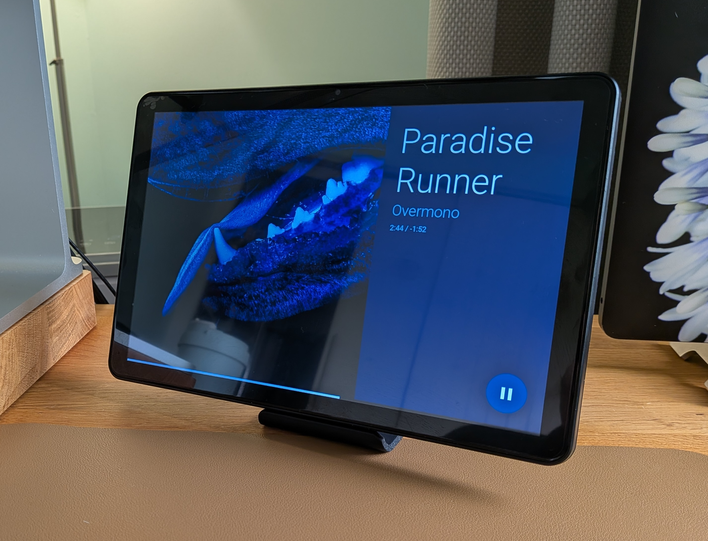

# Guition ESP32-P4 JC8012P4A1 (10.1")

10.1" (1280×800) touchscreen panel with ESP32-P4 and ESP32-C6 coprocessor for WiFi/Bluetooth. Uses a side-panel layout: album art on the left, track info on the right. Tested with Google and Sonos speakers via Home Assistant.

## Install

Use the [Getting Started](/) guide and the web installer there to flash firmware. The installer will detect this device and offer the correct image.

For manual installation via the ESPHome dashboard, see [Manual Setup](/manual-setup) and use the configuration for the ESP32-P4 device (e.g. the `guition-esp32-p4-jc8012p4a1` package from the [repository](https://github.com/jtenniswood/esphome-media-player)).

## Gallery

