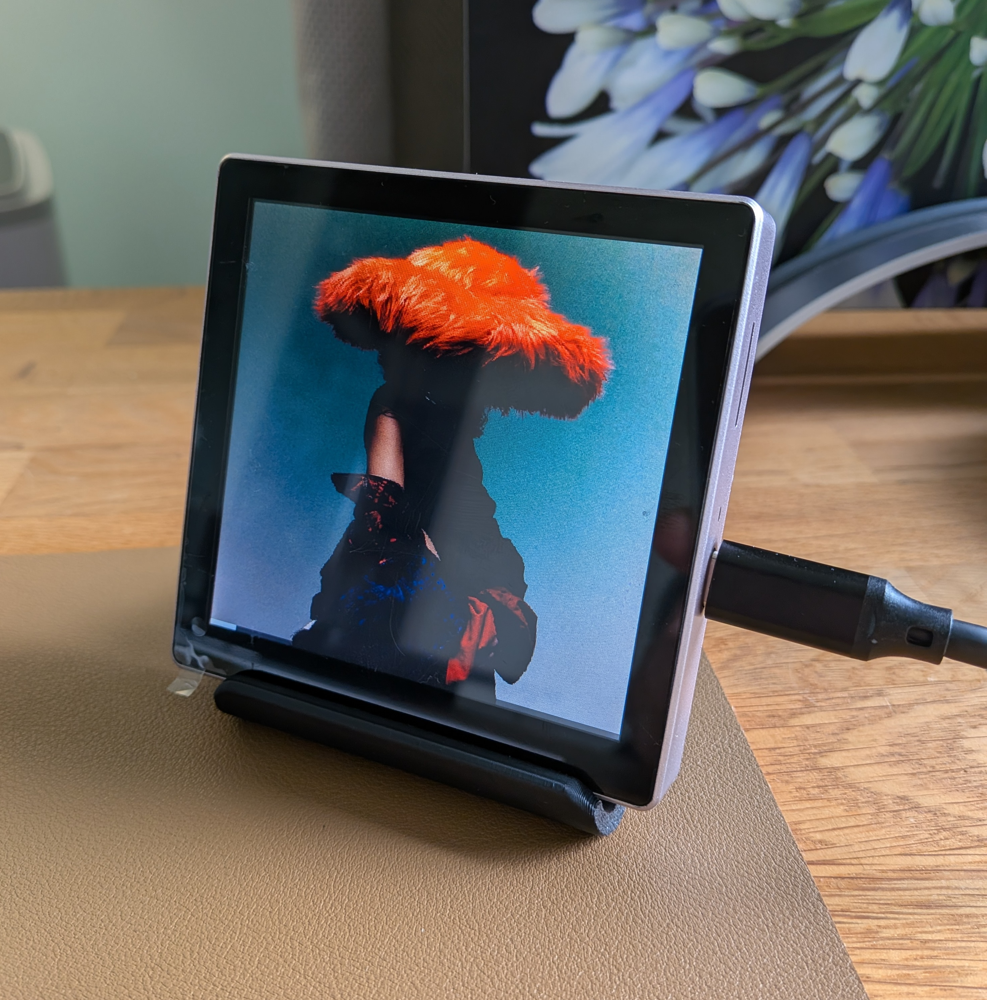
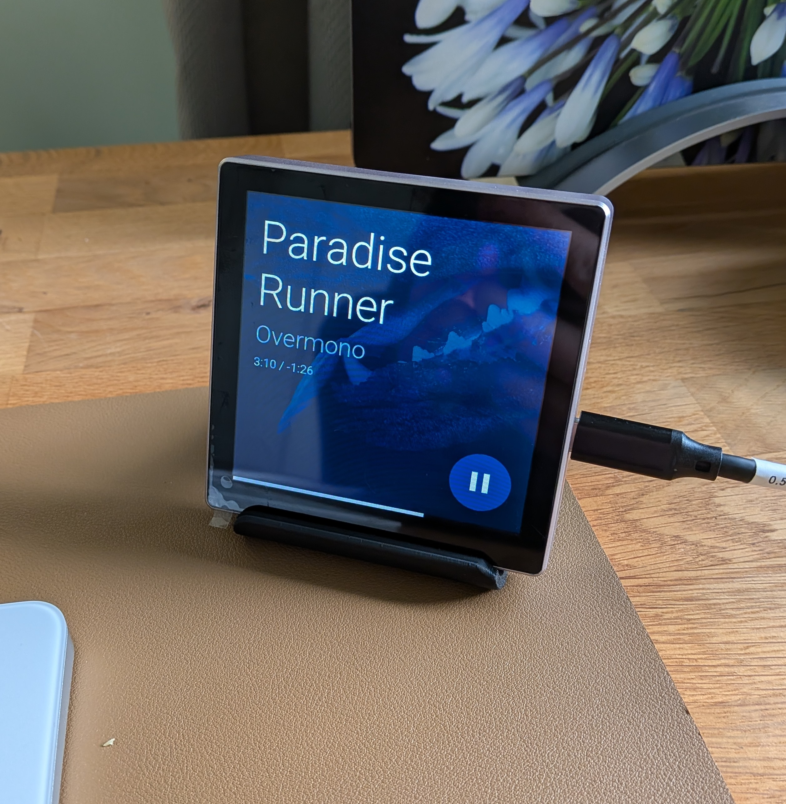
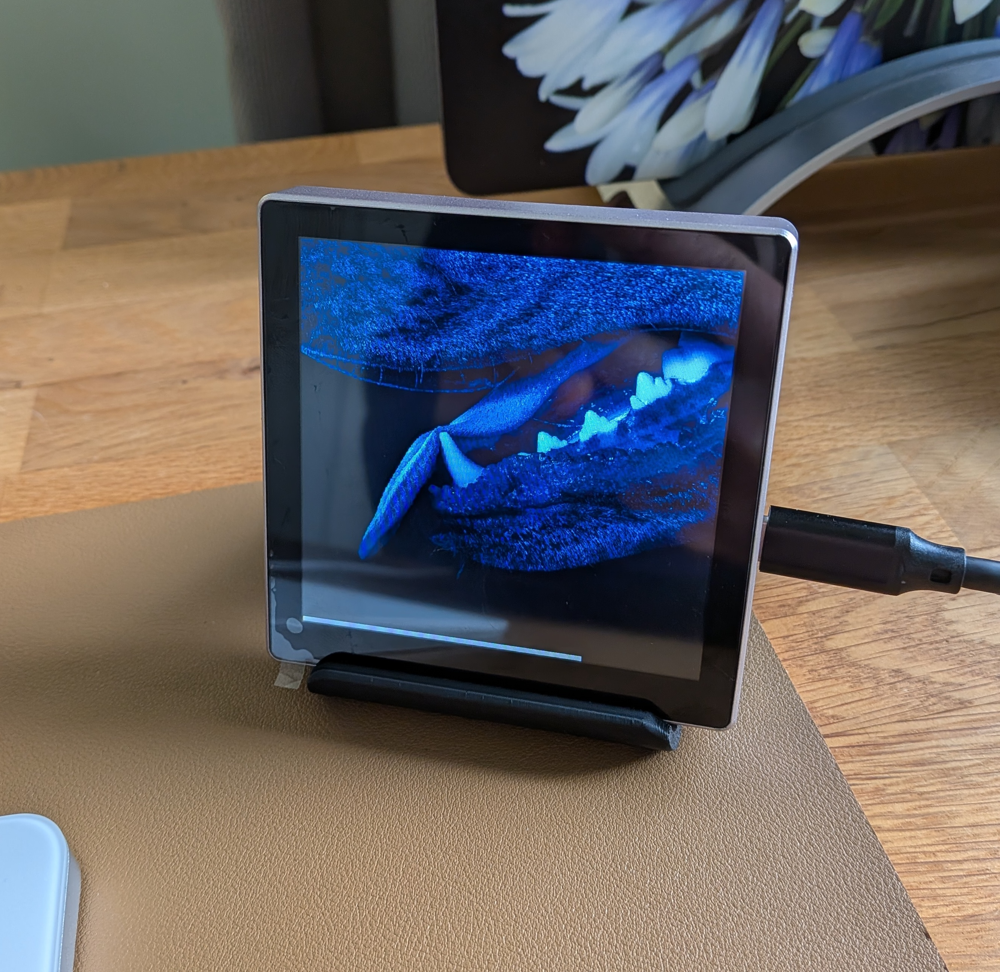
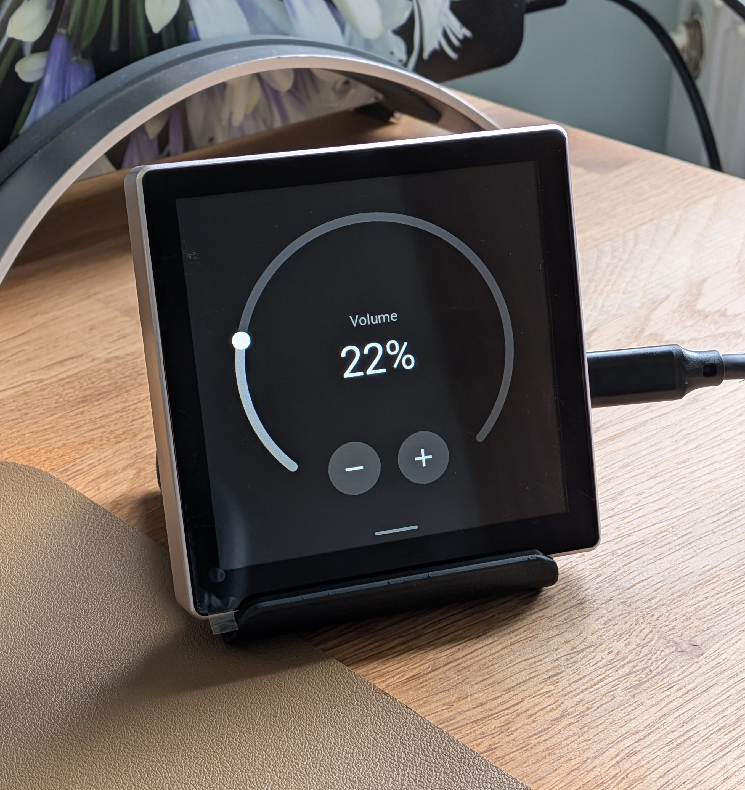

# Guition ESP32-S3 4848S040 (4")

4.0" (480×480) touchscreen panel with ESP32-S3. Uses a full-screen overlay layout with auto-hiding track info. Tested with Google and Sonos speakers via Home Assistant.

## Where to buy

- **Panel:** [AliExpress](https://s.click.aliexpress.com/e/_c3sIhvBv) (~£16)
- **Desktop stand (3D printable):** [MakerWorld](https://makerworld.com/en/models/2327976/touch-screen-desktop-stand-for-guition-4848s040)

## Install

Use the [Getting Started](/) guide and the web installer there to flash firmware. The installer will detect this device and offer the correct image.

For manual installation via the ESPHome dashboard, see [Manual Setup](/manual-setup) (this device uses the `guition-esp32-s3-4848s040` package).

## Gallery

