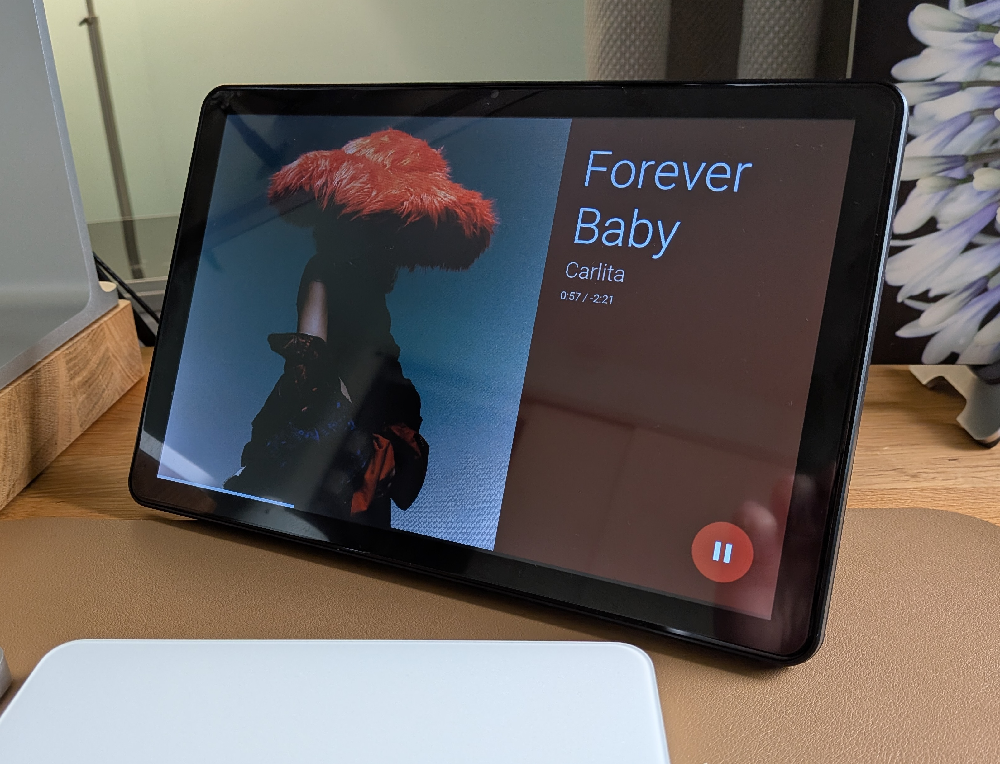
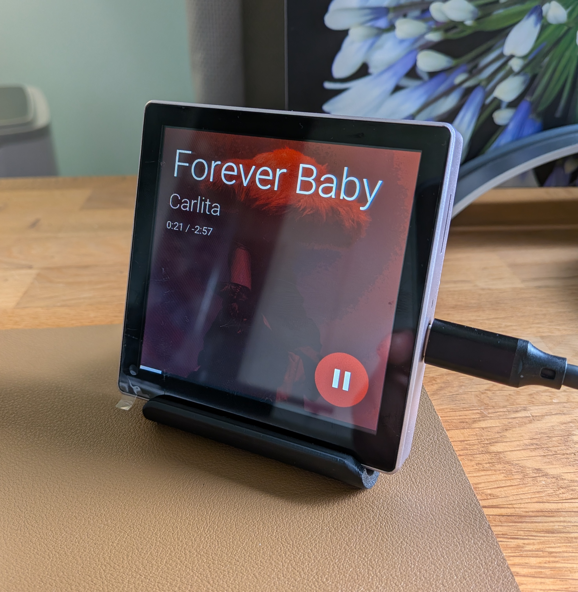

# Getting Started

A touchscreen media controller for Home Assistant: album art, track info, and touch controls for any media player in your smart home. Built with [ESPHome](https://esphome.io/) and [LVGL](https://lvgl.io/).

[Guition ESP32-S3 4848S040 (4")](/devices/esp32-s3-4848s040)

[Guition ESP32-P4 JC8012P4A1 (10.1")](/devices/esp32-p4-jc8012p4a1)

## What you need

- A supported panel (see [Devices](/devices/esp32-s3-4848s040))
- USB-C cable
- **Google Chrome** or **Microsoft Edge** on desktop (for web flashing)
- **Home Assistant** with a media player entity already set up

## Step 1: Flash the firmware

Connect your panel to your computer via USB-C, then use the installer below. It will offer the correct firmware for your device.

<ClientOnly>
  <InstallButton />
  <template #fallback>
    
<em>Loading installer…</em>

  </template>
</ClientOnly>

If the installer doesn’t detect your device, try the [troubleshooting](/troubleshooting#flashing-doesnt-work) section. You may need the [CH340 USB driver](https://www.wch-ic.com/downloads/CH341SER_EXE.html) on your computer.

## Step 2: Connect to WiFi

After flashing, the device starts a WiFi hotspot:

1. Connect to the hotspot from your phone or computer.
2. When the captive portal opens, enter your home WiFi name and password.
3. The device restarts and joins your network.

## Step 3: Adopt in Home Assistant

When the device is on your network:

1. Open **Settings → Devices & Services** and look for a new ESPHome notification.
2. Click **Configure** and complete the adoption steps.
3. The device and its entities will appear in Home Assistant.

## Step 4: Select your media player

1. Go to **Settings → Devices & Services → ESPHome** and click your device.
2. Under **Configuration**, find the **Media Player** field.
3. Enter the entity ID of the player you want to control (e.g. `media_player.living_room`).

The display will start showing the current track. You can change this later without reflashing. For more detail, see [How do I configure a media player?](/troubleshooting#how-do-i-configure-a-media-player).

## Step 5: Enable device controls

To let the panel control play, pause, skip, and volume:

1. Go to **Settings → Devices & Services → Integrations** and click **ESPHome** (not the device count).
2. Find your device and open the **cog** to edit settings.
3. Turn on **“Allow the device to perform Home Assistant actions”** and save.

If the controls don’t respond, see [Controls don’t respond](/troubleshooting#controls-dont-respond).

## Automatic updates

The device checks for firmware updates about every 6 hours. When one is available, a **Firmware Update** entity appears in Home Assistant; you can run the update from there.

## Viewing device logs

Artwork load errors (e.g. when album art fails to download) are logged by the device. To see these messages in Home Assistant for remote debugging:

1. Go to **Settings → Devices & Services → ESPHome** and open your device.
2. Click **Configure** and enable **Subscribe to logs from the device**.
3. When enabled, the device sends logs to Home Assistant. View them in **Settings → System → Logs** or **Developer Tools → Logs**. Filter by your device name or search for the `artwork` tag to find artwork-related errors.

## Next steps

- [Features](/features) — album art, touch controls, screensaver
- [Settings](/configurable-settings) — brightness, timeouts, track info
- [Manual installation](/manual-setup) — flash via ESPHome dashboard instead of the web installer
- [Troubleshooting](/troubleshooting) — common issues and fixes
