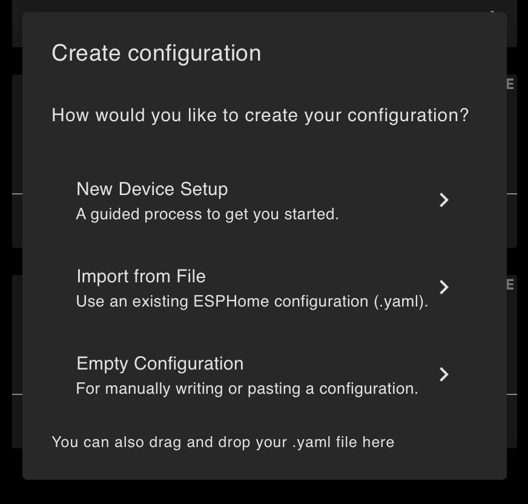
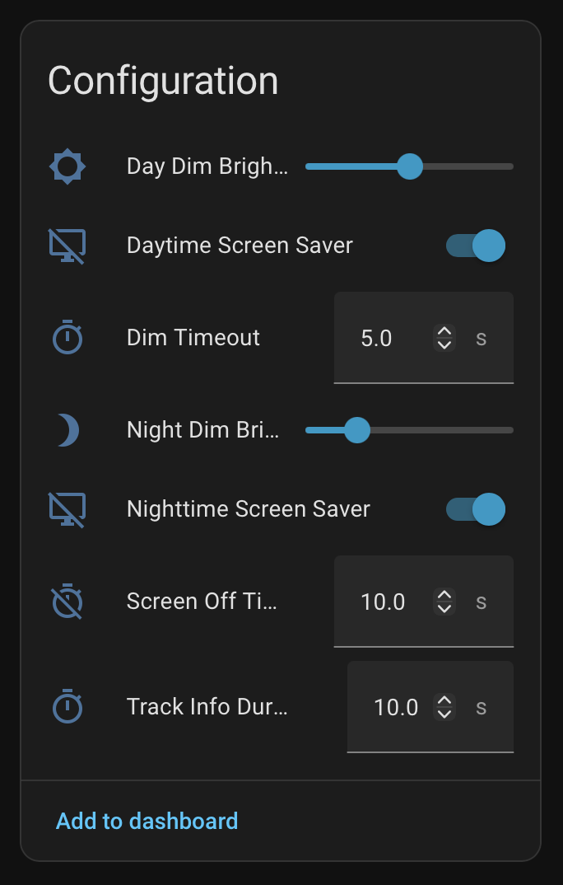

# Manual Setup via ESPHome Dashboard

If you prefer to manage the device through the ESPHome dashboard instead of using the [Web Installer](https://jtenniswood.github.io/esphome-media-player/), you can set it up manually.

## Prerequisites

- A **Guition ESP32-S3-4848S040** panel (see [Where to Buy](../README.md#where-to-buy))
- **Home Assistant** installed and running
- The **ESPHome add-on** (or ESPHome CLI) installed -- [installation guide](https://esphome.io/guides/getting_started_hassio.html)
- A **USB-C cable** for the initial flash
- Your **WiFi network** name and password
- A **media player** already set up in Home Assistant (e.g., Sonos, Google Cast, or any `media_player` entity)

## Step 1: Add a New Device in ESPHome

1. Open the **ESPHome dashboard** in Home Assistant.
2. Click **New Device** in the top-right corner, and then **Continue**.



3. Select **Empty Configuration** to start with a blank template.
4. Give it a name (e.g., `living-room-music`) and click **Next**.
5. Then click **Edit** on the new device being highlighted.

## Step 2: Paste the Template Configuration

Copy and paste the entire contents of the new device's configuration with the template below (also available at [esphome.yaml](../guition-esp32-s3-4848s040/esphome.yaml)):

```yaml
substitutions:
  name: "your-device-name"
  friendly_name: "Your Room Music"
  media_player: ""

wifi:
  ssid: !secret wifi_ssid
  password: !secret wifi_password

packages:
  music_dashboard:
    url: https://github.com/jtenniswood/esphome-media-player
    files: [guition-esp32-s3-4848s040/packages.yaml]
    ref: main
    refresh: 1s
```

## Step 3: Edit Substitutions

Update the `substitutions` block with your own values:

- **`name`** -- a unique hostname for this device (lowercase, hyphens only, no spaces).
- **`friendly_name`** -- the name you want to see in Home Assistant.
- **`media_player`** -- (optional) pre-fill the entity ID of the media player to control. Leave empty (`""`) to set it from Home Assistant after first boot.

## Step 4: Set WiFi Credentials

The template uses ESPHome secrets for WiFi credentials. If you have not already set these up:

1. In the ESPHome dashboard, click **Secrets** in the top-right corner.
2. Add the following lines:

```yaml
wifi_ssid: "YourWiFiNetworkName"
wifi_password: "YourWiFiPassword"
```

3. Click **Save**.

## Step 5: Flash the Firmware

For the first installation, you need to flash via USB and use the Chrome browser:

1. Connect the Guition panel to your computer with a USB-C cable.
2. In the ESPHome dashboard, click the three-dot menu on your device and select **Install**.
3. Choose **Plug into this computer** (or **Manual download** if using the CLI).
4. Wait for the firmware to compile and upload. The first build takes several minutes as it downloads all dependencies.

> **Tip:** If ESPHome does not detect the device over USB, you may need to install the CH340 USB driver for your operating system.

## Step 6: Adopt in Home Assistant

Once the device boots and connects to your WiFi:

1. Home Assistant should automatically discover it. Check **Settings > Devices & Services** for a new ESPHome notification.
2. Click **Configure** and follow the prompts to adopt the device.
3. The device and its entities will appear in Home Assistant.

## Step 7: Select Your Media Player

After adoption, navigate to the device page in Home Assistant:

1. Go to **Settings > Devices & Services > ESPHome**.
2. Click on your device.
3. Under the **Configuration** section, find the **Media Player** text field.
4. Enter the entity ID of the media player you want to control (e.g., `media_player.living_room`). The dashboard will immediately start showing the current track.
5. Optionally adjust the brightness levels, timeouts, and other settings described in [Configurable Settings](../README.md#configurable-settings).


